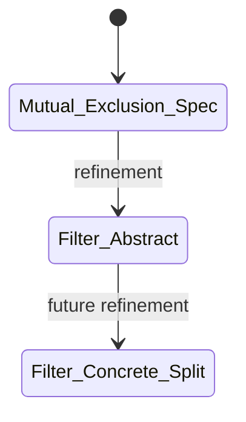

Peterson's Algorithm in Why3 \
*Formal Verification*
=

This project formalizes and verifies Peterson-style mutual exclusion algorithms
in Why3.

The development follows three stages:

1. a monolithic proof for the original 2-process Peterson's algorithm;
2. a monolithic proof-friendly abstraction of the N-process Filter algorithm;
3. a refinement-based development.

## Table of Contents

<!--toc:start-->
- [Peterson's Algorithm in Why3](#petersons-algorithm-in-why3)
  - [Table of Contents](#table-of-contents)
  - [Repository structure](#repository-structure)
  - [Background](#background)
  - [Algorithms](#algorithms)
    - [Two-process Peterson's Algorithm](#two-process-petersons-algorithm)
    - [N-process Filter Algorithm](#n-process-filter-algorithm)
  - [Monolithic proofs](#monolithic-proofs)
    - [`2_processes.mlw`](#2processesmlwsrcmonolithic2processesmlw)
    - [`N_processes.mlw`](#nprocessesmlwsrcmonolithicnprocessesmlw)
    - [`N_processes_split_attempt.mlw`](#nprocessessplitattemptmlwsrcmonolithicnprocessessplitattemptmlw)
  - [Refinement development](#refinement-development)
    - [`mutual_exclusion_spec.mlw`](#mutualexclusionspecmlwsrcrefinementmutualexclusionspecmlw)
    - [`filter_abstract.mlw`](#filterabstractmlwsrcrefinementfilterabstractmlw)
    - [`filter_concrete_split.mlw`](#filterconcretesplitmlwsrcrefinementfilterconcretesplitmlw)
  - [Main proof results](#main-proof-results)
  - [Limitations and future work](#limitations-and-future-work)
  - [Running Why3](#running-why3)
    - [Solvers](#solvers)
  - [Summary](#summary)
  - [References](#references)
<!--toc:end-->

<div style="page-break-after: always;"></div>

## Repository structure

```
.
├── presentation
│   ├── output
│   │   └── presentation.pdf
│   ├── Makefile
│   └── presentation.tex
├── src
│   ├── lib
│   │   ├── inductiveness.mlw
│   │   └── refinement.mlw
│   ├── monolithic
│   │   ├── 2_processes.mlw
│   │   ├── N_processes.mlw
│   │   └── N_processes_split_attempt.mlw
│   └── refinement
│       ├── mutual_exclusion_spec.mlw
│       ├── filter_abstract.mlw
│       └── filter_concrete_split.mlw
└── README.md
```

Respective Why3 session files are next to the `.mlw` monolithic and refinement
models.

See the [Running Why3](#running-why3) section for instructions on how to run
the Why3 IDE on the various models.

## Background

Peterson's algorithm is a mutual exclusion algorithm for two processes.
It uses shared variables to ensure that **at most one process** can enter the
critical section at a time.

It does not require a lock or other synchronization primitives, making it a
classic example of a software-only mutual exclusion algorithm.

<div style="page-break-after: always;"></div>

## Algorithms

### Two-process Peterson's Algorithm

The original Peterson's algorithm is for exactly two processes.
Each process announces that it wants to enter the critical section, gives
priority to the other process, and then waits until either the other process
no longer wants the critical section or the priority has returned to itself.

```ocaml
var
    turn : 0..1;
    want0 : boolean = false;
    want1 : boolean = false;

procedure process0;
begin
    while true do
    begin
0:      (* idle *)

1:      want0 := true;
2:      turn  := 1;
3:      repeat until (not want1 or turn = 0);

4:      (* critical region *)

5:      want0 := false;
    end
end;

procedure process1;
begin
    while true do
    begin
0:      (* idle *)

1:      want1 := true;
2:      turn  := 0;
3:      repeat until (not want0 or turn = 1);

4:      (* critical region *)

5:      want1 := false;
    end
end;

process0 || process1
```

In the Why3 model, this is represented by:

```why3
type process = P0 | P1
type state = Zero | One | Two | Three | Four | Five
```

with shared variables:

```why3
want : map process bool
turn : process
```

The labels correspond to:

```text
Zero   = idle
One    = set want[p] := true
Two    = set turn := other p
Three  = wait until not want[other p] or turn = p
Four   = critical section
Five   = set want[p] := false
```

The proved safety property is mutual exclusion:

```why3
forall p q.
  pc[p] = Four ->
  pc[q] = Four ->
  p = q
```

<div style="page-break-after: always;"></div>

### N-process Filter Algorithm

For `N` processes, the usual generalization of Peterson's algorithm is the
**Filter algorithm**.

Each process passes through levels `1` to `N - 1`. At every level `l`, process
`i` declares:

```ocaml
level[i]  := l;
victim[l] := i;
```

Then it waits while there exists another process at the same or a higher level
and `i` is still the victim at level `l`.

```ocaml
var
    level  : array [0..N-1] of integer = [0, ..., 0];
    victim : array [1..N-1] of integer;

procedure process(i);
begin
    while true do
    begin
0:      (* idle *)

        for l = 1 to N-1 do
        begin
1:          level[i]  := l;
2:          victim[l] := i;
3:          repeat until
                forall k.
                    k != i ->
                    level[k] < l or victim[l] != i;
        end;

4:      (* critical region *)

5:      level[i] := 0;
    end
end;

process(0) || process(1) || ... || process(N-1)
```

<div style="page-break-after: always;"></div>

In the Why3 models, processes are represented as integers:

```why3
type process = int

predicate valid_process (p:process) =
  0 <= p < n_processes
```

The Filter algorithm uses the shared variables:

```why3
lvl    : map process level
victim : map level process
```

The waiting condition is represented by:

```why3
predicate waiting_guard (w:world) (p:process) =
  forall q:process.
    valid_process q ->
    q <> p ->
    w.lvl[q] < w.lvl[p] \/ w.victim[w.lvl[p]] <> p
```

The key invariant for the N-process proof is the Filter counting property:

```why3
predicate filter_bound (w:world) =
  forall l:level.
    valid_level l ->
    count_passed_level w l n_processes <= n_processes - l
```

This captures the standard informal proof:

```text
At level l, at most N-l processes can have passed that level.
```

At the final level, `l = N - 1`, this gives at most one process.
Therefore, at most one process can enter the critical section.

<div style="page-break-after: always;"></div>

## Monolithic proofs

### [`2_processes.mlw`](src/monolithic/2_processes.mlw)

This file contains the proved monolithic model of the original two-process
Peterson's algorithm.

The model uses:

```why3
type process = P0 | P1
type state = Zero | One | Two | Three | Four | Five
```

The shared variables are:

```why3
want : map process bool
turn : process
```

The main safety property is:

```why3
predicate atMostOneCS (w:world) =
  forall p q:process.
    w.pc[p] = Four ->
    w.pc[q] = Four ->
    p = q
```

The proof uses an inductive invariant strengthening `atMostOneCS`. In particular,
it records when `want[p]` is true and how the waiting condition prevents both
processes from reaching the critical section.

Status:

```text
Proved: reachable w -> atMostOneCS w
```

<div style="page-break-after: always;"></div>

### [`N_processes.mlw`](src/monolithic/N_processes.mlw)

This file contains the proved abstract monolithic model for the N-process Filter
algorithm.

The model uses a proof-friendly abstraction of the Filter algorithm:

```text
Zero  -> Three     level[p] := 1; victim[1] := p
Three -> Three     pass level l, then level[p] := l+1; victim[l+1] := p
Three -> Four      pass final level
Four  -> Five
Five  -> Zero
```

The key invariant is the standard Filter-algorithm counting property:

```why3
predicate filter_bound (w:world) =
  forall l:level.
    valid_level l ->
    count_passed_level w l n_processes <= n_processes - l
```

This expresses the usual Filter argument:

> At level `l`, at most `N - l` processes can have passed that level.

At the final level, `l = N - 1`, this implies that at most one process can have
passed the last level. Therefore, at most one process can be in the critical
section.

Status:

```text
Proved: reachable w -> atMostOneCS w
```

**Important note**: this model is proof-friendly and abstract. Its transition
guards include conditions ensuring that the invariant is preserved by the target
state. This makes it suitable as an intermediate abstraction and as a refinement
target.

<div style="page-break-after: always;"></div>

### [`N_processes_split_attempt.mlw`](src/monolithic/N_processes_split_attempt.mlw)

This file contains a more concrete split-step attempt for the N-process Filter
algorithm.

It uses the more operational transition structure:

```text
Zero -> One -> Two -> Three -> Four -> Five
```

where the doorway section is split into separate atomic steps:

```text
level[p] := l
victim[l] := p
```

This model is closer to the concrete algorithm, but the arbitrary-N proof is
significantly harder. The local invariant is proved, and the intended global
safety invariant is stated, but the full inductiveness proof for the global
counting invariant is left as future work.

Status:

```text
Proved: local invariant
Stated: safety invariant implies mutual exclusion
Open: full arbitrary-N inductiveness of the counting invariant
```

<div style="page-break-after: always;"></div>

## Refinement

The refinement development follows the style of the course notes: start from a
very abstract specification, then add implementation details in later models.

The refinement chain is:

<!--
```text
Mutual_Exclusion_Spec
  ↑ refined by
Filter_Abstract
  ↑ future refinement target
Filter_Concrete_Split
```
-->



### [`mutual_exclusion_spec.mlw`](src/refinement/mutual_exclusion_spec.mlw)

This is the most abstract specification.

It does not mention Filter levels, victims, or Peterson-specific variables.
It only tracks whether each process is:

```why3
Idle | Trying | CS | Exit
```

The specification allows a process to enter the critical section only when no
other process is already there.

The invariant is simply:

```why3
predicate inv (w:world) =
  atMostOneCS w
```

Status:

```text
Proved: reachable w -> atMostOneCS w
```

<div style="page-break-after: always;"></div>

### [`filter_abstract.mlw`](src/refinement/filter_abstract.mlw)

This model refines the abstract mutual-exclusion specification.

It introduces the Filter algorithm variables:

```why3
lvl    : map process level
victim : map level process
```

and uses the same counting invariant as the monolithic N-process proof:

```why3
forall l.
  valid_level l ->
  count_passed_level w l n_processes <= n_processes - l
```

The refinement map hides the Filter-specific variables and keeps only the
abstract control state:

```why3
let ghost function refn (w:world) : Mutual_Exclusion_Spec.world =
  { pc = w.fpc }
```

Thus, `lvl` and `victim` are implementation details that are not visible at the
abstract mutual-exclusion level.

Status:

```text
Proved: Filter_Abstract refines Mutual_Exclusion_Spec
Proved: reachable w -> atMostOneCS w
Proved by refinement: reachableC w -> Mutual_Exclusion_Spec.atMostOneCS (refn w)
```

<div style="page-break-after: always;"></div>

### [`filter_concrete_split.mlw`](src/refinement/filter_concrete_split.mlw)

This file contains the next concrete refinement target.

It models a more operational split-step version of the Filter algorithm:

```text
IdleC      -> SetLevel
SetLevel   -> SetVictim
SetVictim  -> TryingC
TryingC    -> SetLevel    // next level
TryingC    -> CSC         // critical section
CSC        -> ExitC
ExitC      -> IdleC
```

This model is closer to the actual algorithm because it separates:

```ocaml
level[i] := l
victim[l] := i
```

into different atomic transitions.

The intended next refinement is:

```text
Filter_Concrete_Split refines Filter_Abstract
```

The main difficulty is choosing a refinement map that hides the intermediate
doorway states `SetLevel` and `SetVictim`.

A likely mapping is:

```text
IdleC      -> Idle
SetLevel   -> Trying or Idle
SetVictim  -> Trying or Idle
TryingC    -> Trying
CSC        -> CS
ExitC      -> Exit
```

However, mapping `SetLevel` and `SetVictim` cleanly also requires deciding how
to abstract the partially updated `lvl` and `victim` maps.
This is left as future work.

Status:

```text
Defined: concrete split-step state machine
Open: refinement proof to Filter_Abstract
```

<div style="page-break-after: always;"></div>

## Main proof results

The completed proof results are:

```text
1. Two-process Peterson:
   reachable w -> atMostOneCS w

2. Abstract N-process Filter algorithm:
   reachable w -> atMostOneCS w

3. Abstract mutual-exclusion specification:
   reachable w -> atMostOneCS w

4. Refinement:
   Filter_Abstract refines Mutual_Exclusion_Spec
```

<div style="page-break-after: always;"></div>

## Limitations and future work

The fully concrete arbitrary-N Filter proof remains open.

The main missing step is proving that the global counting invariant is inductive
for the fully operational split-step model. This requires auxiliary lemmas about
how the recursive counting functions behave under map updates.

In particular, the proof must show that when a process passes a level, the
waiting condition guarantees that the number of processes past that level
remains bounded by:

```why3
n_processes - l
```

This is the core proof obligation for the fully concrete N-process Filter
algorithm.

## Running Why3

```sh
# To run the Why3 IDE on the 2-process Peterson model:
why3 ide -L src/lib src/monolithic/2_processes.mlw

# To run the Why3 IDE on the abstract N-process Filter model:
why3 ide -L src/lib src/monolithic/N_processes.mlw

# To run the Why3 IDE on the split-step attempt N-process Filter model:
why3 ide -L src/lib src/monolithic/N_processes_split_attempt.mlw

# To run the Why3 IDE on the refinement-based models:
why3 ide -L src/lib -L src/refinement \
    src/refinement/mutual_exclusion_spec.mlw

why3 ide -L src/lib -L src/refinement \
    src/refinement/filter_abstract.mlw

why3 ide -L src/lib -L src/refinement \
    src/refinement/filter_concrete_split.mlw
```

### Solvers

- [Alt-Ergo 2.4.3](https://alt-ergo.ocamlpro.com/)
- [Z3 4.15.2](https://github.com/z3prover/z3)

<div style="page-break-after: always;"></div>

## Summary

This project verifies Peterson-style mutual exclusion in Why3.

The two-process Peterson proof is completed directly. The N-process Filter
algorithm is verified at an abstract monolithic level using the standard
counting invariant. A refinement-based development then introduces a cleaner
abstraction hierarchy, where the Filter model refines a generic mutual-exclusion
specification by hiding the implementation details `lvl` and `victim`.

The concrete split-step Filter model is included as the next refinement target.

## References

- [Peterson's Algorithm (Wikipedia)](https://en.wikipedia.org/wiki/Peterson%27s_algorithm)

## Related work

- [A Proof of Peterson's Algorithm (in Coq) by James Wilcox](https://jamesrwilcox.com/SharedMem.html)
